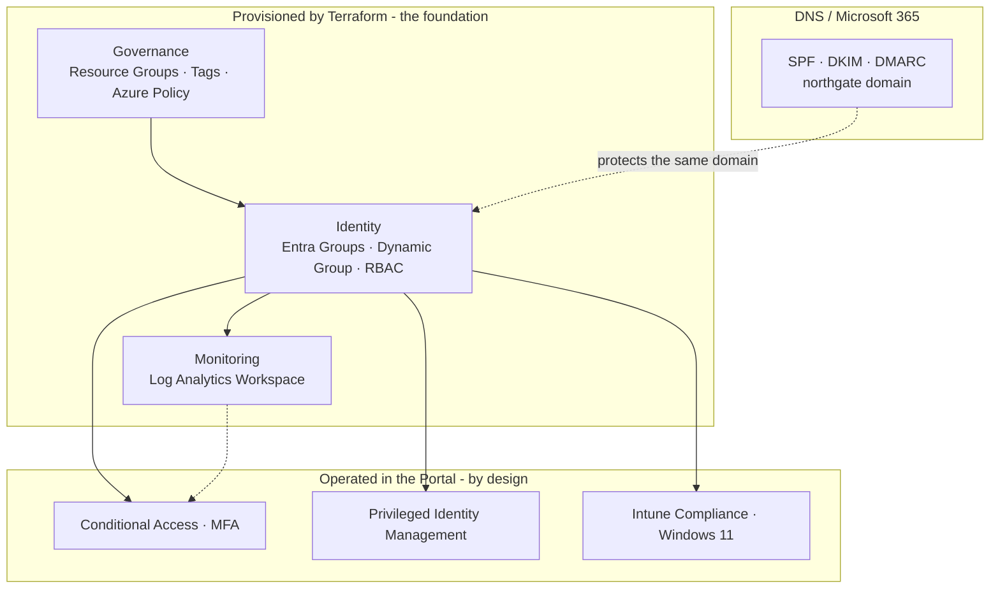
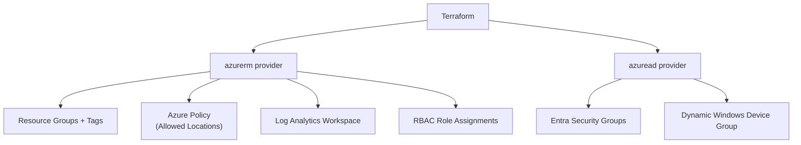
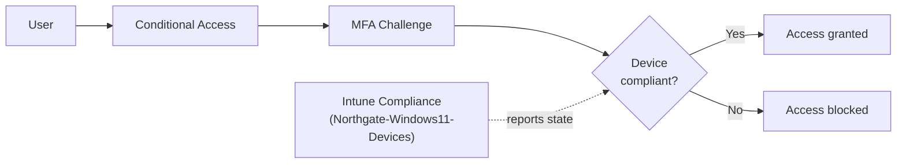

# Architecture

This document describes the unified architecture of the Northgate Solutions environment across all five pillars: Infrastructure as Code, governance, identity, endpoints, email security, and monitoring.

---

## Overview

The environment is built in layers. Terraform provisions the **foundation** — the repeatable governance, identity, and monitoring scaffolding. Operational controls (Conditional Access, PIM, Intune) and email authentication are layered on top of that foundation and operated where each belongs. The guiding principle is that the foundation is code, and the sensitive operational controls are deliberately operated in the portal.

---

## The layered model

---

## How Terraform provisions the foundation

Terraform uses two providers — `azurerm` for Azure resources and `azuread` for Entra ID — to build everything in the foundation layer from a single folder of `.tf` files.

| File | Provisions |
|------|-----------|
| `resource-groups.tf` | Tagged resource groups (`rg-northgate-identity`, `rg-northgate-monitoring`) |
| `governance.tf` | The "Allowed locations" Azure Policy assignment |
| `identity.tf` | `Northgate-Helpdesk` and the dynamic `Northgate-Windows11-Devices` group |
| `rbac.tf` | Least-privilege Reader role for Helpdesk, scoped to one resource group |
| `monitoring.tf` | The `log-northgate-core` Log Analytics workspace |
| `outputs.tf` | Resource names and IDs surfaced after apply |

---

## Identity and access flow

Access to resources passes through Conditional Access, which evaluates both the user (MFA) and the device (Intune compliance state) before granting access. Intune feeds device compliance back into the access decision.

---

## Monitoring

The Log Analytics workspace (`log-northgate-core`), provisioned by Terraform, is the central destination for Entra ID sign-in and audit logs. Routing is configured via Entra diagnostic settings (in the portal, because tenant-level diagnostic settings sit outside the Azure resource model). This gives the foundation a single, queryable monitoring surface using KQL.

---

## Email security

SPF, DKIM, and DMARC protect the same `northgate` domain from spoofing. This layer lives at the DNS provider and in Exchange Online rather than in Azure. It closes a gap that identity controls cannot: Conditional Access and MFA stop unauthorized *sign-ins*, but they do nothing about an attacker *impersonating the domain* to phish users. Email authentication addresses exactly that, completing the security picture for the organization.

---

## Assumptions and scope

This is a self-directed lab, not a production deployment. The environment uses a single fictional company (Northgate Solutions) across one Entra tenant and one subscription. Device counts are small and representative. Where a control would be implemented differently at scale, that is noted in [SECURITY-DECISIONS.md](SECURITY-DECISIONS.md).

---

## Future state

- Remote Terraform backend (Azure Storage) with state locking, replacing local state.
- Conditional Access and Intune policy managed as code via the Microsoft Graph provider, once it matures for this scope.
- SPF/DKIM/DMARC DNS records managed in code if the domain's DNS were hosted in Azure DNS.
- A Microsoft Sentinel layer on top of the existing Log Analytics workspace for alerting.
