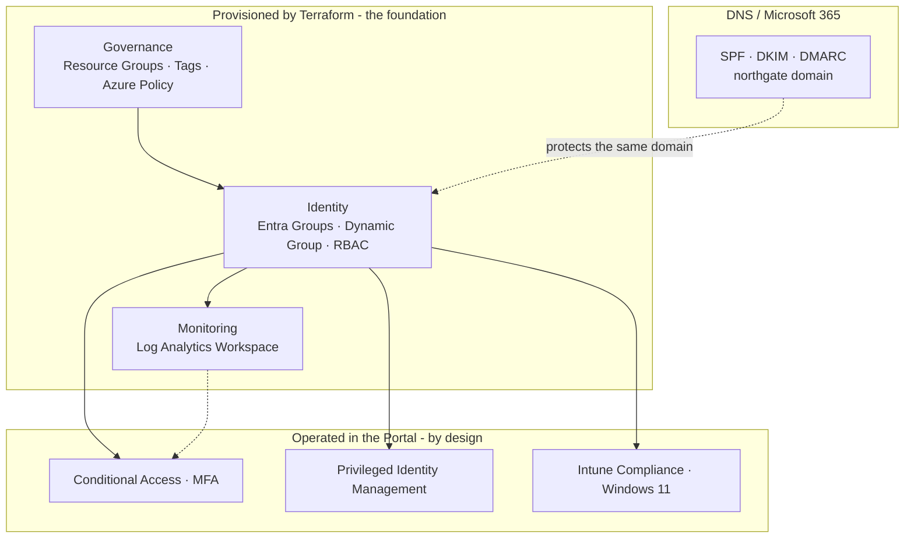

# Enterprise Cloud Security Portfolio

> A unified, self-directed lab where **Terraform** provisions an Azure governance and identity foundation, and **Microsoft Entra ID, Intune, email authentication, and centralized monitoring** are layered on top — one connected enterprise environment for a fictional company, **Northgate Solutions**.

## Architecture at a glance

---

## The story

Northgate Solutions is standing up a secure Microsoft cloud environment from scratch. The platform team provisions the repeatable foundation - governance, identity, and monitoring - with Terraform. On top of it, the identity team enforces access with Conditional Access and PIM, the endpoint team manages Windows 11 devices with Intune, and the messaging team protects the corporate domain with SPF, DKIM, and DMARC. The result is one environment where Infrastructure as Code, identity, endpoints, email, and monitoring reinforce each other - and where every manual control is a deliberate, documented choice rather than a gap.

---

## The five pillars

| Pillar | What it does | Project |
|--------|--------------|---------|
| **Infrastructure as Code** | Terraform provisions governance, identity, RBAC, and monitoring | [enterprise-cloud-foundation-lab](https://github.com/darewiin/enterprise-cloud-foundation-lab) |
| **Cloud Governance** | Resource groups, tagging strategy, Azure Policy guardrails | [enterprise-cloud-foundation-lab](https://github.com/darewiin/enterprise-cloud-foundation-lab) |
| **Identity & Access** | Entra ID, dynamic groups, RBAC, Conditional Access, PIM, MFA | [unified-endpoint-management-lab](https://github.com/darewiin/unified-endpoint-management-lab) |
| **Endpoint Management** | Intune compliance and configuration on Windows 11 | [unified-endpoint-management-lab](https://github.com/darewiin/unified-endpoint-management-lab) |
| **Email Security** | SPF, DKIM, and DMARC on the Northgate domain | [enterprise-email-authentication-lab](https://github.com/darewiin/enterprise-email-authentication-lab) |

---

## Tech stack

Microsoft Azure · Microsoft Entra ID · Microsoft Intune · Terraform (`azurerm`, `azuread`) · Azure Log Analytics · Microsoft 365 / Exchange Online

---

## Key design decisions

- **Terraform owns the repeatable foundation** (governance, identity groups, RBAC, monitoring). Conditional Access and PIM are operated in the portal **by design** - to avoid lockout risk and preserve approval workflows.
- **RBAC is scoped least-privilege** to resource groups rather than the whole subscription, limiting blast radius.
- **Local Terraform state** is used for this lab; a production deployment would use a remote backend with state locking.

See **[SECURITY-DECISIONS.md](SECURITY-DECISIONS.md)** for the full reasoning behind the Infrastructure-as-Code boundary.

---

## Documentation

- **[ARCHITECTURE.md](ARCHITECTURE.md)** - the unified architecture across all five pillars
- **[SECURITY-DECISIONS.md](SECURITY-DECISIONS.md)** - what is code vs. portal, and why
- **[LESSONS-LEARNED.md](LESSONS-LEARNED.md)** - honest reflection across the initiative

---

## Repositories

- **[enterprise-cloud-foundation-lab](https://github.com/darewiin/enterprise-cloud-foundation-lab)** - Terraform IaC foundation
- **[unified-endpoint-management-lab](https://github.com/darewiin/unified-endpoint-management-lab)** - Azure governance, Entra ID, Intune
- **[enterprise-email-authentication-lab](https://github.com/darewiin/enterprise-email-authentication-lab)** - SPF / DKIM / DMARC email security

---

## About

Built as a self-directed lab by **Darwin Marmolejos** - early-career IT professional focused on systems administration, cloud support, and identity/endpoint engineering.
[LinkedIn](https://www.linkedin.com/in/your-handle) <!-- update with your profile URL -->
